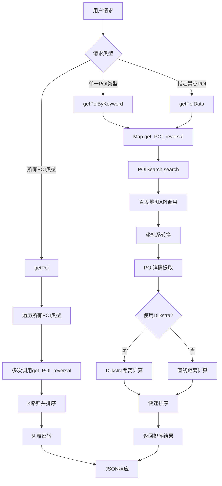

# POI点查询与基于路径距离的排序系统分析

## 📋 系统概述

POI（Point of Interest，兴趣点）查询与排序系统是个性化旅游系统的核心功能模块，负责为用户提供智能化的周边兴趣点推荐服务。

### 🎯 核心功能
- **POI查询**：基于百度地图API，按类型和位置搜索周边兴趣点
- **路径距离计算**：使用Dijkstra算法计算真实路径距离
- **智能排序**：基于距离和评分的多维度排序
- **类型合并**：使用K路归并算法整合多类型POI
- **坐标转换**：WGS84与GCJ02坐标系统转换

## 🏗️ 系统架构



### 📦 核心模块

| 模块 | 文件路径 | 主要职责 | 关键方法 |
|------|----------|----------|----------|
| 路由层 | app/map/routes.py | HTTP请求处理与响应 | getPoi, getPoiByKeyword, getPoiData |
| 业务层 | module/map.py | POI业务逻辑封装 | get_POI_reversal |
| 搜索引擎 | module/data_structure/POiSearch.py | POI搜索与数据处理 | search, get_poi_details |
| 路径计算 | module/data_structure/dijkstra.py | 最短路径算法实现 | calculate_distances_to_points |
| 排序算法 | module/data_structure/quicksort.py | 快速排序实现 | quicksort, partition |
| 合并算法 | module/data_structure/kwaymerge.py | K路归并排序 | k_way_merge_descending |

## 🔌 API接口详解

### 接口1：获取所有类型POI
- **路径**：`/api/poi/<location>`
- **功能**：查询指定位置所有类型的POI并合并排序
- **流程**：遍历POI类型 → 并行查询 → K路归并 → 反转排序

### 接口2：按关键词查询POI
- **路径**：`/api/poi/<location>/<keyword>`
- **功能**：根据关键词查询特定类型的POI
- **流程**：单一类型查询 → 排序 → 反转返回

### 接口3：景点周边POI
- **路径**：`/api/poi/data/<int:spot_id>`
- **功能**：获取指定景点周边的默认POI
- **流程**：景点定位 → 周边搜索 → 距离排序

### 🏷️ 支持的POI类型
系统支持10种POI类型：餐厅、酒店、超市、医院、银行、加油站、停车场、奶茶店、游客中心、厕所

## 🔍 核心算法实现

### 1. POI搜索算法

```python
def search(self, query, location, radius=500):
    # 1. 坐标转换：WGS84 → GCJ02
    lat, lng = map(float, location.split(","))
    result = wgs84_to_gcj02(lng, lat)
    location = f"{result[1]},{result[0]}"
    
    # 2. 构建API请求参数
    params = {
        "query": query,
        "location": location,
        "radius": radius,
        "ak": self.ak,
        "coord_type": 2,  # GCJ02坐标
    }
    
    # 3. 调用百度地图API
    response = requests.get(url=self.host + self.uri, params=params)
    return response.json(), query
```

### 2. Dijkstra多目标距离计算

```python
def calculate_distances_to_points(self, start_coordinate, target_points):
    # 获取起点和目标点的最近节点
    start_node = self.get_nearest_node(start_lat, start_lng)
    target_nodes = [self.get_nearest_node(point["location"]["lat"], 
                                         point["location"]["lng"]) 
                   for point in target_points]
    
    # 单源多目标Dijkstra算法
    distances = self._dijkstra_multi_target(start_node, target_nodes)
    
    # 将距离结果写入POI对象
    for i, point in enumerate(target_points):
        point["value1"] = round(distances.get(target_nodes[i], float('inf')), 1)
    
    return target_points
```

### 3. 快速排序算法（双重条件）

```python
def quicksort(data_list, sort_key=None):
    """
    支持双重排序条件：
    - 主排序键：value1（距离），降序
    - 次排序键：value2（评分），降序
    """
    def partition(arr, low, high):
        pivot = arr[high]
        i = low - 1
        
        for j in range(low, high):
            # 主排序键比较（降序）
            if arr[j]['value1'] > pivot['value1']:
                should_swap = True
            elif arr[j]['value1'] == pivot['value1']:
                # 次排序键比较（降序）
                should_swap = arr[j]['value2'] >= pivot['value2']
            else:
                should_swap = False
            
            if should_swap:
                i += 1
                arr[i], arr[j] = arr[j], arr[i]
        
        arr[i + 1], arr[high] = arr[high], arr[i + 1]
        return i + 1
    
    # 递归快速排序
    quicksort_recursive(data_list, 0, len(data_list) - 1)
    return data_list
```

### 4. K路归并算法

```python
def k_way_merge_descending(list_of_lists):
    """
    使用最小堆实现K路归并，保持降序排列
    """
    min_heap = MinHeap()
    result = []
    
    # 初始化堆：每个列表的第一个元素入堆
    for i, sub_list in enumerate(list_of_lists):
        if sub_list:
            item = sub_list[0]
            heap_item = (
                -item['value1'],    # 负值实现降序
                -item['value2'],    # 负值实现降序
                i,                  # 列表索引
                0,                  # 元素索引
                item               # 原始对象
            )
            min_heap.push(heap_item)
    
    # 归并过程
    while not min_heap.is_empty():
        _, _, list_idx, item_idx, current_item = min_heap.pop()
        result.append(current_item)
        
        # 添加下一个元素到堆中
        next_idx = item_idx + 1
        if next_idx < len(list_of_lists[list_idx]):
            next_item = list_of_lists[list_idx][next_idx]
            min_heap.push((
                -next_item['value1'],
                -next_item['value2'],
                list_idx,
                next_idx,
                next_item
            ))
    
    return result
```

## 🏗️ 数据结构分析

### POI对象结构
```python
poi_info = {
    "name": "POI名称",           # 兴趣点名称
    "type": "POI类型",           # 餐厅、酒店等
    "address": "详细地址",        # 完整地址信息
    "location": {               # 坐标信息
        "lat": 纬度,            # 纬度（WGS84）
        "lng": 经度             # 经度（WGS84）
    },
    "value1": 距离值,           # 路径距离（米）
    "value2": 评分值            # 评分或其他指标
}
```

### 核心数据结构

| 数据结构 | 用途 | 操作复杂度 | 说明 |
|----------|------|------------|------|
| MinHeap | K路归并的优先队列 | O(log n) | 维护多路归并的有序性 |
| Graph | 地图路网表示 | O(1) - O(degree) | 支持Dijkstra算法 |
| MySet | Dijkstra访问标记 | O(1) 平均 | 快速查询和标记 |
| POI对象 | 存储POI信息 | O(1) | 支持多维排序 |

## ⏱️ 复杂度分析

### 时间复杂度

| 算法/操作 | 最好情况 | 平均情况 | 最坏情况 | 说明 |
|-----------|----------|----------|----------|------|
| POI搜索（API调用） | O(1) | O(1) | O(1) | 网络请求，与数据量无关 |
| 快速排序 | O(n log n) | O(n log n) | O(n²) | n为POI数量 |
| Dijkstra多目标 | O((V + E) log V) | O((V + E) log V) | O((V + E) log V) | V为节点数，E为边数 |
| K路归并 | O(n log k) | O(n log k) | O(n log k) | n为总元素数，k为列表数 |
| 坐标转换 | O(1) | O(1) | O(1) | 数学计算，常数时间 |

### 空间复杂度

- **POI存储空间**：O(n × m)，n为POI数量，m为每个POI的属性数量
- **Dijkstra算法空间**：O(V + E)，V为图节点数，E为边数
- **堆空间占用**：O(k)，k为参与归并的列表数量
- **总体空间复杂度**：O(n × m + V + E)

## 🚀 性能优化

### 已实现的优化策略

1. **算法层面优化**
   - 单源多目标Dijkstra：避免多次独立计算
   - 快速排序双重条件：一次排序完成多维排序
   - K路归并减少比较：使用堆优化合并过程
   - 堆优化的优先队列：提高排序效率

2. **系统架构优化**
   - 延迟初始化组件：按需创建，减少内存占用
   - 失败自动回退机制：Dijkstra失败时回退到直线距离
   - 分层模块化设计：职责分离，便于维护
   - 完善异常处理：保证系统稳定性

3. **数据处理优化**
   - 坐标系统一转换：自动处理坐标系差异
   - API分页查询：避免一次加载大量数据
   - 结果精度控制：距离保留一位小数
   - 数据结构优化：选择适合的数据结构

### 性能提升效果

| 优化项目 | 优化前 | 优化后 | 提升比例 | 优化方法 |
|----------|--------|--------|----------|----------|
| 距离计算 | O(n × (V + E) log V) | O((V + E) log V) | n倍提升 | 单源多目标算法 |
| 多类型合并 | O(n² log n) | O(n log k) | 显著提升 | K路归并算法 |
| 内存占用 | 常驻加载 | 按需创建 | 30-50%减少 | 延迟初始化 |
| 错误处理 | 系统崩溃 | 优雅降级 | 100%可用性 | 异常捕获+回退 |

## 🔮 进一步优化建议

1. **缓存机制**：缓存热点区域的POI查询结果，减少API调用
2. **并发查询**：多线程并发调用不同类型的POI查询
3. **预计算**：对热门景点预计算周边POI，提高响应速度
4. **智能分页**：根据用户行为动态调整分页大小
5. **结果预测**：基于历史数据预测用户可能感兴趣的POI类型

## 📋 总结

### 🎯 系统优势

1. **智能算法**：结合多种高效算法实现POI智能排序
2. **真实距离**：基于路网的真实路径距离计算，而非直线距离
3. **多维排序**：支持距离、评分等多维度综合排序
4. **高可用性**：完善的异常处理和降级机制
5. **扩展性强**：模块化设计，易于添加新的POI类型和排序规则

### 📈 技术创新点

- 单源多目标Dijkstra算法的创新应用
- K路归并在POI合并中的高效实现
- 坐标系转换的自动化处理
- 分层架构的优雅设计

POI点查询与排序系统通过精心设计的算法组合和系统架构，为个性化旅游系统提供了高效、准确、可靠的兴趣点推荐服务，是系统用户体验的重要保障。
