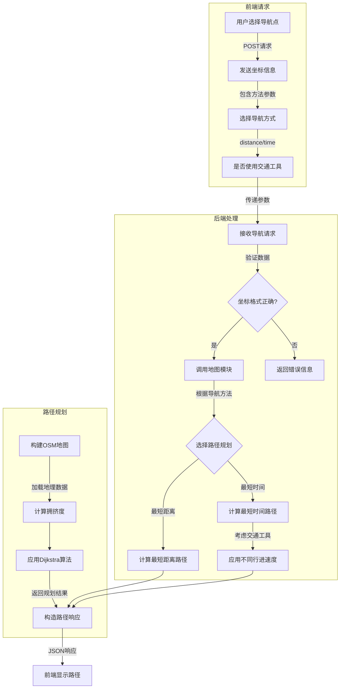
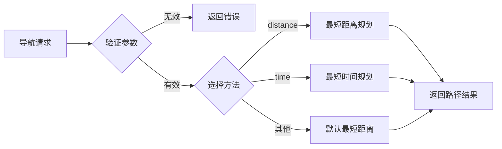
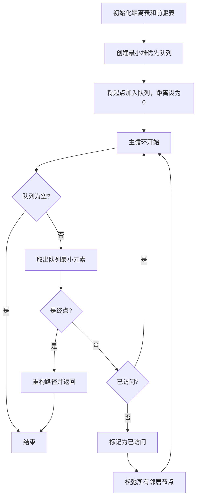
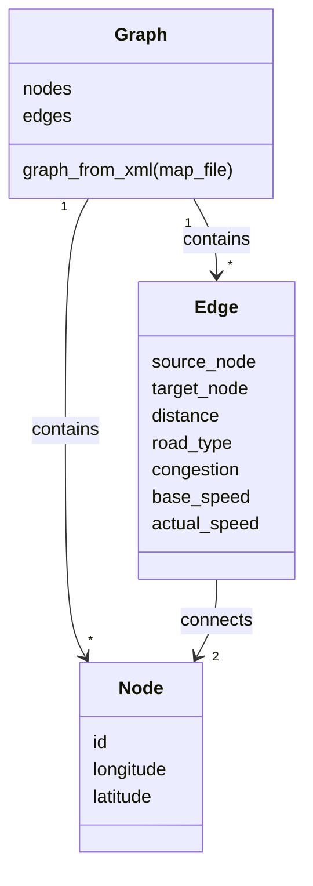

# 地图导航功能流程分析

## 导航功能概述

个性化旅游系统的地图导航功能支持多种导航方式，包括最短距离路径、最短时间路径，以及考虑交通工具的路径规划。核心功能由Dijkstra算法提供支持，基于OpenStreetMap地图数据实现精确的路径计算。

## 导航处理流程图



## 不同导航方法处理流程

### 路由方法选择流程



### 最短距离导航

- **优化目标**：物理距离最短
- **边权重**：道路的实际物理长度（米）
- **不考虑因素**：交通状况、道路类型、行进速度
- **算法实现**：标准Dijkstra算法，权重为路段长度

### 最短时间导航

- **优化目标**：行进时间最短
- **边权重计算**：基于以下因素
  - 路段长度
  - 道路类型（决定基础速度）
  - 拥挤度（影响实际速度）
  - 交通工具选择（决定速度范围）
- **计算公式**：
  ```
  时间 = 距离 / (拥挤度 × 基础速度)
  ```
- **交通工具影响**：
  - 不使用交通工具时，使用默认步行速度（5 km/h）
  - 使用交通工具时，根据道路类型选择相应速度

## Dijkstra算法核心流程



## 多点路径规划算法


## 地图数据结构



## 拥挤度与速度机制

- **拥挤度范围**：0.2-1.0
  - 0.2：严重拥堵（速度降低80%）
  - 1.0：畅通无阻（全速行驶）
  
- **道路类型与基础速度**：
  | 道路类型 | 基础速度(km/h) |
  |---------|--------------|
  | 高速公路(motorway) | 80 |
  | 国道(trunk) | 70 |
  | 主干道(primary) | 70 |
  | 次干道(secondary) | 50 |
  | 三级道路(tertiary) | 30 |
  | 住宅区道路(residential) | 30 |
  | 服务道路(service) | 15 |
  | 自行车道(cycleway) | 15 |
  | 人行道(footway) | 5 |
  | 小径(path) | 5 |

- **实际速度计算**：
  ```
  actual_speed = congestion × base_speed
  ```

## 算法时间复杂度分析

| 算法/操作 | 时间复杂度 | 说明 |
|---------|-----------|-----|
| 单源最短路径(Dijkstra + 最小堆) | O((V+E)log V) | V为顶点数，E为边数 |
| 多目标Dijkstra | O((V+E)log V) | 相比单目标无明显额外开销 |
| 最近邻算法 | O(n²) | n为途径点数量 |
| 2-opt局部优化 | O(n²) | n为途径点数量 |
| 完整多点路径规划 | O(n² + (V+E)log V) | 包含点对间最短路径计算 |

## POI搜索与导航集成

- **搜索流程**：调用百度地图API获取周边POI
- **坐标转换**：WGS84与GCJ02坐标系统间转换
- **距离计算**：使用Dijkstra算法计算实际路径距离
- **排序规则**：根据POI与当前位置的实际距离排序

## 总结

个性化旅游系统的地图导航功能通过结合Dijkstra最短路径算法、OpenStreetMap地图数据和拥挤度模拟，实现了高效、灵活的路径规划解决方案。系统支持多种导航策略，考虑交通工具、道路类型和拥挤程度等实际因素，为用户提供精确的导航服务。
