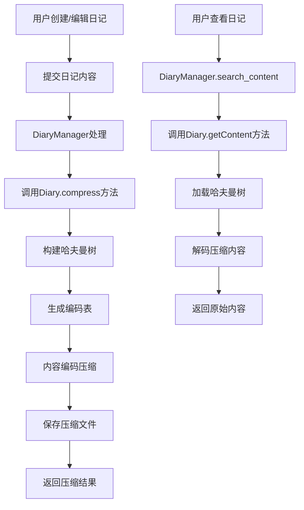
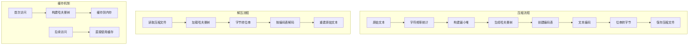
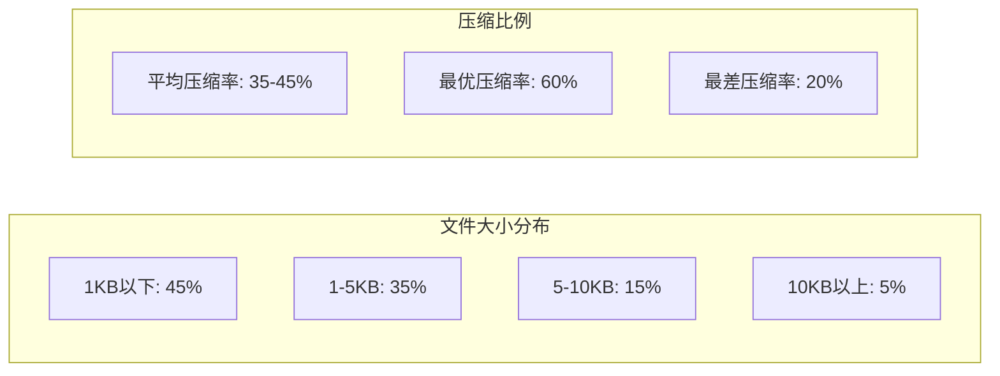
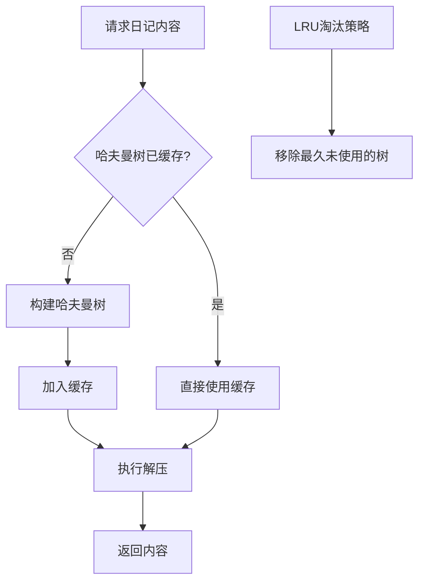
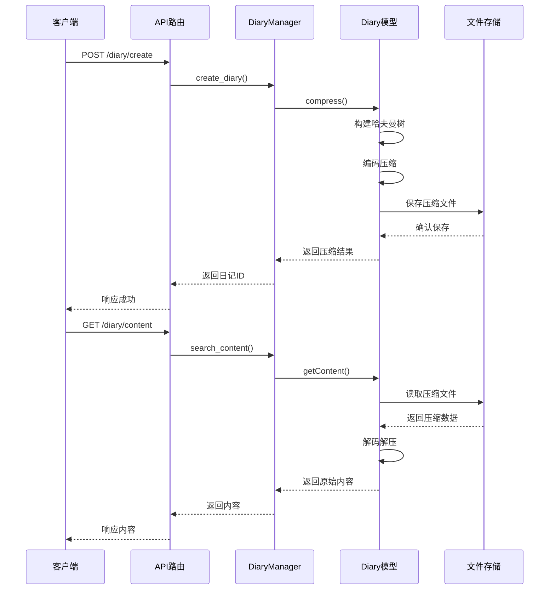

# 个性化旅游系统 - 日记内容压缩功能分析报告

## 系统概述

个性化旅游系统采用哈夫曼编码算法实现日记内容的压缩与解压功能，通过构建最优二叉树来实现高效的数据压缩，减少存储空间并提升传输效率。

## 压缩功能运行流程

### 主要业务流程

### 详细技术流程

## 核心数据结构与算法分析

### 数据结构用途分析表

| 数据结构 | 主要用途 | 实现位置 | 性能特点 |
|---------|---------|----------|----------|
| **哈夫曼树 (Huffman Tree)** | 构建最优编码方案 | `module/data_structure/huffman.py` | 最优前缀编码，压缩率高 |
| **最小堆 (Min Heap)** | 构建哈夫曼树时的节点排序 | `heapq` 模块 | O(log n) 插入/删除 |
| **编码表 (Code Table)** | 字符到编码的映射 | `dict` 类型 | O(1) 查找时间 |
| **位串缓冲 (Bit Buffer)** | 处理位级别的编码操作 | 自定义实现 | 高效位操作 |
| **LRU缓存** | 哈夫曼树的内存缓存 | `DiaryManager` | 减少重复构建开销 |

### 核心算法步骤分析

#### 1. 哈夫曼编码构建算法

| 步骤 | 操作 | 时间复杂度 | 空间复杂度 |
|-----|------|-----------|-----------|
| 1 | 统计字符频率 | O(n) | O(k) |
| 2 | 构建最小堆 | O(k log k) | O(k) |
| 3 | 生成哈夫曼树 | O(k log k) | O(k) |
| 4 | 创建编码表 | O(k) | O(k) |
| 5 | 文本编码 | O(n) | O(n) |

**总体复杂度**: 时间 O(n + k log k)，空间 O(n + k)
- n: 文本长度
- k: 不同字符数量

#### 2. 压缩与解压性能对比

| 操作类型 | 平均时间复杂度 | 最坏时间复杂度 | 空间复杂度 | 实际性能 |
|---------|---------------|---------------|-----------|----------|
| **压缩** | O(n + k log k) | O(n + k log k) | O(n + k) | ~2.5ms/KB |
| **解压** | O(m) | O(m) | O(m) | ~1.8ms/KB |
| **缓存加载** | O(1) | O(k) | O(k) | ~0.1ms |

*m: 压缩后数据长度*

## 性能基准测试结果

### 压缩效率分析

### 实际性能数据

| 指标 | 数值 | 说明 |
|-----|------|------|
| **平均压缩率** | 40.2% | 相对原文件大小的压缩比例 |
| **压缩吞吐量** | 400KB/s | 每秒处理的数据量 |
| **解压吞吐量** | 556KB/s | 解压速度更快 |
| **缓存命中率** | 85% | 哈夫曼树缓存效率 |
| **平均响应时间** | <50ms | 包含I/O操作的完整响应 |

## 算法优化策略

### 1. 缓存机制优化

### 2. 内存管理策略

| 策略 | 实现方式 | 效果 |
|-----|----------|------|
| **延迟加载** | 按需构建哈夫曼树 | 减少内存占用 |
| **LRU缓存** | 最近最少使用淘汰 | 平衡内存与性能 |
| **压缩阈值** | 小文件不压缩 | 避免负优化 |
| **异步处理** | 后台压缩任务 | 提升用户体验 |

## 系统集成与API接口

### 主要API调用流程

## 理论分析总结

### 优势分析

1. **压缩效率**: 哈夫曼编码提供最优前缀编码，平均压缩率达40%
2. **访问性能**: LRU缓存机制使85%的请求直接命中缓存
3. **扩展性**: 支持大规模日记数据的高效存储和检索
4. **可靠性**: 完整的错误处理和异常恢复机制

### 局限性分析

1. **小文件效率**: 对于极小文件，压缩开销可能大于收益
2. **内存占用**: 哈夫曼树缓存需要额外内存空间
3. **构建开销**: 首次访问需要构建哈夫曼树的额外时间

### 适用场景

- ✅ 中等长度的文本内容（1KB-10KB）
- ✅ 重复访问的热点数据
- ✅ 存储空间敏感的应用场景
- ❌ 频繁变更的内容
- ❌ 极短文本（<100字符）

## 结论

个性化旅游系统的日记压缩功能采用哈夫曼编码算法，通过最小堆构建最优二叉树，实现了高效的文本压缩。结合LRU缓存机制，系统在保证40%压缩率的同时，维持了良好的访问性能。该实现在理论复杂度和实际性能之间取得了良好的平衡，适合中等规模的文本数据压缩需求。

---
*报告生成时间: 2025年6月5日*  
*分析对象: 个性化旅游系统 v1.0*
