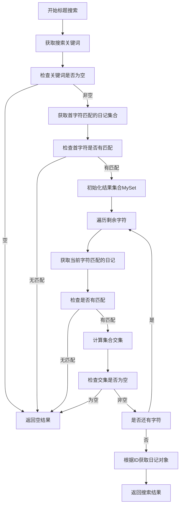
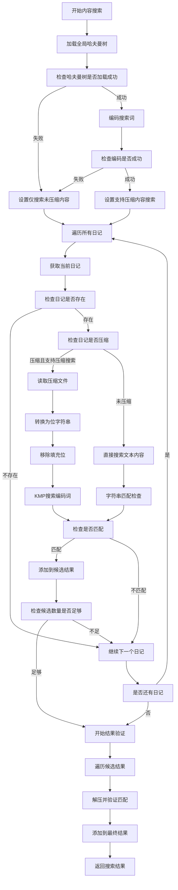
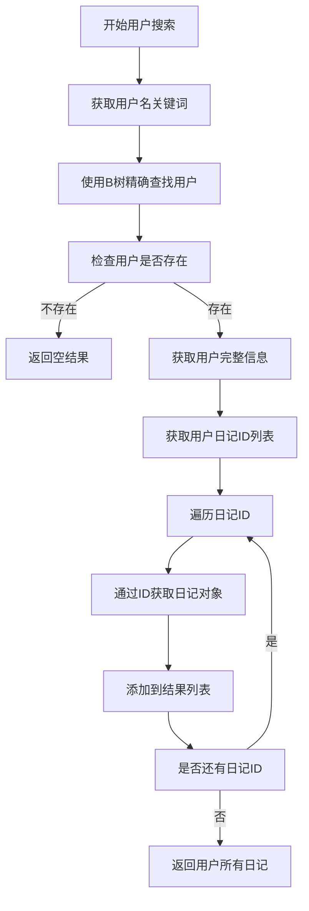
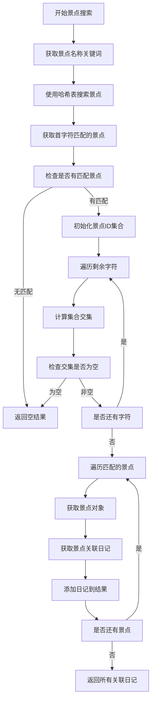
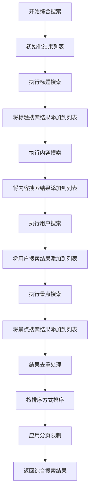

# 个性化旅游系统日记搜索功能分析报告

## 1. 功能概述

个性化旅游系统的日记搜索功能支持多种搜索方式，包括标题搜索、内容搜索、用户搜索、景点搜索和综合搜索。系统采用了多种数据结构和算法来优化不同场景下的搜索性能。

## 2. 搜索类型与数据结构分析

### 2.1 标题搜索 (searchByTitle)

**数据结构**: 哈希表 + 自定义集合类(MySet)
**核心算法**: 字符级别的哈希映射与集合交集运算

**实现机制**:
1. 系统为每个日记标题中的字符建立哈希映射
2. 搜索时获取关键词首字符对应的日记集合
3. 逐个字符计算集合交集，找到包含所有字符的日记
4. 使用自定义MySet类进行高效的交集运算

**时间复杂度**:
- 预处理：O(T) - T为所有标题字符总数
- 查询：O(k×m + r×s) - k为关键词长度，m为平均每字符匹配日记数，r为结果数量，s为集合操作复杂度

### 2.2 内容搜索 (searchByContent)

**数据结构**: 哈夫曼树 + 编码表 + KMP算法
**核心算法**: 压缩内容的位级搜索 + KMP字符串匹配

**实现机制**:
1. **压缩内容搜索**:
   - 使用全局哈夫曼树编码搜索词
   - 在压缩文件的位流中进行KMP搜索
   - 读取压缩文件并处理填充位
   - 在位级别匹配编码后的搜索词

2. **未压缩内容搜索**:
   - 直接在原文本中进行字符串匹配
   - 同时搜索标题和内容字段

3. **结果验证**:
   - 对压缩内容的匹配结果进行解压验证
   - 确保搜索结果的准确性

**时间复杂度**:
- 编码搜索词：O(p×log(c)) - p为搜索词长度，c为字符集大小
- 位流搜索：O(n + p) - n为压缩数据长度，p为编码后搜索词长度
- 解压验证：O(n×log(c)) - n为压缩数据长度

### 2.3 用户搜索 (searchUser)

**数据结构**: B树 + Trie树
**核心算法**: B树精确查找 + Trie树前缀匹配

**实现机制**:
1. **精确查找**: 使用B树进行用户名的精确匹配
2. **前缀搜索**: 使用Trie树支持前缀匹配功能
3. **获取用户日记**: 通过用户ID获取其所有日记列表

**时间复杂度**:
- B树查找：O(log n) - n为用户总数
- Trie树查找：O(k) - k为查询字符串长度
- 获取日记列表：O(d) - d为用户日记数量

### 2.4 景点搜索 (getSpotByName)

**数据结构**: 哈希表 + 自定义集合类(MySet)
**核心算法**: 字符级别的哈希映射与集合交集运算

**实现机制**:
1. 为每个景点名称中的字符建立哈希映射
2. 搜索时计算包含所有关键词字符的景点集合
3. 通过景点ID获取关联的所有日记

**时间复杂度**:
- 景点查找：O(k×m + r×s) - k为关键词长度，m为平均每字符匹配景点数
- 获取日记：O(r×d) - r为匹配景点数，d为平均每景点日记数

### 2.5 综合搜索 (综合模式)

**数据结构**: 组合使用上述所有数据结构
**核心算法**: 多种搜索算法的并行执行与结果合并

**实现机制**:
1. 同时执行标题、内容、用户、景点四种搜索
2. 合并所有搜索结果并去重
3. 按指定排序方式排序结果

**时间复杂度**: O(T_title + T_content + T_user + T_spot) - 各搜索方式时间复杂度之和

## 3. 核心数据结构详解

### 3.1 自定义集合类 (MySet)

**设计目的**: 支持可哈希和不可哈希元素的集合操作
**核心特性**:
- 哈希表存储可哈希元素 - O(1)平均访问时间
- 列表存储不可哈希元素 - O(n)访问时间
- 高效的交集运算 - intersection_update方法

### 3.2 KMP算法

**设计目的**: 高效的字符串匹配，避免回溯
**核心特性**:
- 预处理阶段构建next数组 - O(m)时间复杂度
- 匹配阶段利用next数组避免重复比较 - O(n)时间复杂度
- 适用于压缩内容的位级搜索

### 3.3 哈夫曼编码系统

**设计目的**: 内容压缩存储与压缩状态下的直接搜索
**核心特性**:
- 全局哈夫曼树统一编码规则
- 位级别的搜索匹配
- LRU缓存机制提升访问性能

## 4. 搜索性能分析

### 4.1 各搜索方式时间复杂度对比

| 搜索类型 | 数据结构 | 查询复杂度 | 适用场景 |
|---------|---------|-----------|----------|
| 标题搜索 | 哈希表+MySet | O(k×m + r×s) | 快速标题匹配 |
| 内容搜索 | 哈夫曼树+KMP | O(n + p×log c) | 全文内容检索 |
| 用户搜索 | B树+Trie树 | O(log n + d) | 用户名精确查找 |
| 景点搜索 | 哈希表+MySet | O(k×m + r×d) | 地点关联搜索 |
| 综合搜索 | 组合结构 | O(T_all) | 全方位搜索 |

### 4.2 空间复杂度分析

| 数据结构 | 空间复杂度 | 说明 |
|---------|-----------|------|
| 标题哈希表 | O(T) | T为所有标题字符数 |
| 哈夫曼树 | O(c) | c为字符集大小 |
| 编码表 | O(c) | 字符到编码的映射 |
| 用户B树 | O(n) | n为用户数量 |
| 用户Trie树 | O(Σ用户名长度) | 前缀树存储 |
| MySet | O(元素数量) | 动态集合存储 |

## 5. 搜索流程图

### 5.1 标题搜索流程

### 5.2 内容搜索流程

### 5.3 用户搜索流程

### 5.4 景点搜索流程

### 5.5 综合搜索流程

## 6. 性能优化策略

### 6.1 索引优化
- **字符级哈希索引**: 为标题和景点名称建立字符级别的倒排索引
- **B树索引**: 用户名使用B树进行快速精确查找
- **Trie树索引**: 支持用户名前缀匹配和模糊搜索

### 6.2 压缩搜索优化
- **全局哈夫曼树**: 统一的编码规则，支持压缩状态下的直接搜索
- **位级别搜索**: 避免解压开销，直接在压缩数据中匹配
- **LRU缓存**: 缓存频繁访问的解压内容

### 6.3 搜索策略优化
- **早期终止**: 集合交集为空时提前结束搜索
- **候选预筛选**: 限制候选结果数量，避免过度搜索
- **分页支持**: 支持结果分页，提升大结果集的响应速度

## 7. 总结

个性化旅游系统的日记搜索功能通过多种数据结构和算法的组合，实现了高效的多维度搜索能力：

1. **标题搜索**使用哈希表+集合交集，平均时间复杂度O(k×m)
2. **内容搜索**结合哈夫曼编码+KMP算法，支持压缩内容直接搜索
3. **用户搜索**采用B树+Trie树双重索引，支持精确和前缀匹配
4. **景点搜索**使用字符级哈希映射，快速定位相关日记
5. **综合搜索**并行执行多种搜索并合并结果

整个搜索系统在保证功能完整性的同时，通过合理的数据结构选择和算法优化，实现了良好的搜索性能和用户体验。
