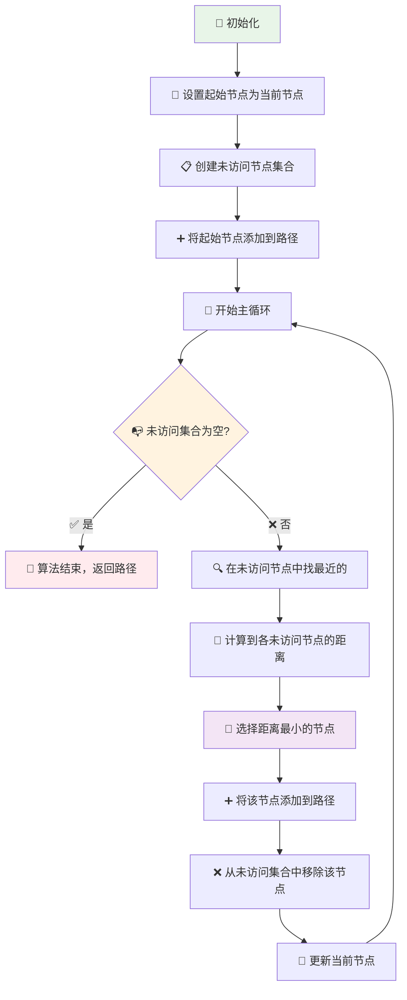
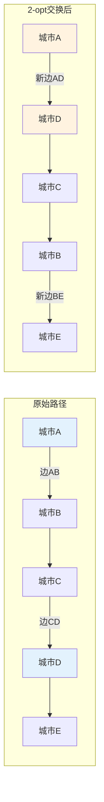
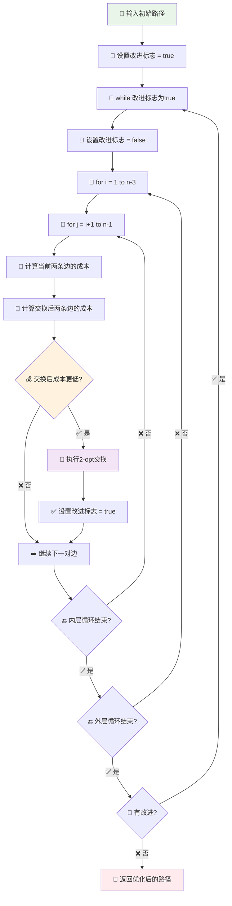

# 最近邻算法与2-opt算法详解

## 算法背景

在个性化旅游系统的地图导航功能中，当用户需要经过多个途径点时，系统需要解决**旅行商问题(Traveling Salesman Problem, TSP)**。TSP是一个经典的组合优化问题，目标是找到访问所有城市且每个城市只访问一次的最短路径。

由于TSP是NP-hard问题，对于实时导航系统来说，需要在计算时间和解质量之间找到平衡。本系统采用**最近邻算法**构建初始解，然后使用**2-opt算法**进行局部优化。

## 最近邻算法(Nearest Neighbor Algorithm)

### 算法原理

最近邻算法是一种简单直观的贪心算法，其核心思想是：
- 从起始城市开始
- 每次选择距离当前城市最近的未访问城市
- 重复这个过程直到所有城市都被访问

### 算法流程图



### 算法实现

```python
def nearest_neighbor_algorithm(start_node, nodes, distance_matrix):
    """
    最近邻算法实现
    
    Args:
        start_node: 起始节点
        nodes: 所有节点列表
        distance_matrix: 距离矩阵，distance_matrix[i][j]表示节点i到节点j的距离
    
    Returns:
        tour: 访问顺序列表
        total_distance: 总距离
    """
    # 初始化
    unvisited = set(nodes) - {start_node}  # 未访问节点集合
    tour = [start_node]                    # 路径从起点开始
    current_node = start_node              # 当前节点
    total_distance = 0                     # 总距离
    
    # 主循环：直到所有节点都被访问
    while unvisited:
        # 找到距离当前节点最近的未访问节点
        nearest_node = None
        min_distance = float('inf')
        
        for node in unvisited:
            distance = distance_matrix[current_node][node]
            if distance < min_distance:
                min_distance = distance
                nearest_node = node
        
        # 更新路径和状态
        tour.append(nearest_node)
        unvisited.remove(nearest_node)
        total_distance += min_distance
        current_node = nearest_node
    
    return tour, total_distance
```

### 算法分析

**时间复杂度：**
- 外层循环：O(n) - 需要访问n个节点
- 内层循环：O(n) - 每次需要在剩余节点中找最近的
- 总体复杂度：O(n²)

**空间复杂度：**
- O(n) - 存储未访问节点集合和路径

**优缺点分析：**

✅ **优点：**
- 算法简单，易于理解和实现
- 时间复杂度相对较低，适合实时应用
- 总能找到一个可行解
- 对于某些特殊情况能找到最优解

❌ **缺点：**
- 贪心策略可能陷入局部最优
- 解的质量很大程度上取决于起始节点的选择
- 在某些情况下可能产生质量较差的解

### 实际应用示例

考虑一个简单的4个城市的例子：

```
城市: A(起点), B, C, D
距离矩阵:
    A  B  C  D
A   0  2  9  10
B   1  0  6  4
C   15 7  0  8
D   6  3  12 0
```

**执行过程：**
1. 从A开始，未访问：{B, C, D}
2. A到B=2, A到C=9, A到D=10，选择B (最小距离2)
3. 当前在B，未访问：{C, D}
4. B到C=6, B到D=4，选择D (最小距离4)
5. 当前在D，未访问：{C}
6. D到C=12，选择C
7. 最终路径：A→B→D→C，总距离=2+4+12=18

## 2-opt算法(2-opt Algorithm)

### 算法原理

2-opt算法是一种局部搜索优化算法，通过**边交换**来改善TSP解的质量。算法的核心思想是：
- 选择路径中的两条边
- 尝试重新连接这两条边
- 如果新的连接方式能减少总距离，则采用新的连接

### 2-opt交换机制



**交换效果：**
- 移除边：AB和CD
- 添加边：AD和BC
- 中间部分路径方向反转

### 算法流程



### 算法实现

```python
def two_opt_algorithm(tour, distance_matrix):
    """
    2-opt算法实现
    
    Args:
        tour: 初始路径
        distance_matrix: 距离矩阵
    
    Returns:
        optimized_tour: 优化后的路径
        total_distance: 优化后的总距离
    """
    n = len(tour)
    improved = True
    
    while improved:
        improved = False
        
        # 遍历所有可能的边对
        for i in range(1, n - 2):
            for j in range(i + 1, n):
                if j == n - 1:  # 避免处理最后一条回到起点的边
                    continue
                
                # 计算当前两条边的成本
                current_cost = (
                    distance_matrix[tour[i-1]][tour[i]] +
                    distance_matrix[tour[j]][tour[j+1]]
                )
                
                # 计算交换后两条边的成本
                new_cost = (
                    distance_matrix[tour[i-1]][tour[j]] +
                    distance_matrix[tour[i]][tour[j+1]]
                )
                
                # 如果交换能降低成本，则执行交换
                if new_cost < current_cost:
                    # 执行2-opt交换：反转子序列tour[i:j+1]
                    tour[i:j+1] = reversed(tour[i:j+1])
                    improved = True
    
    # 计算最终总距离
    total_distance = 0
    for i in range(len(tour) - 1):
        total_distance += distance_matrix[tour[i]][tour[i+1]]
    
    return tour, total_distance
```

### 算法分析

**时间复杂度：**
- 外层while循环：取决于收敛速度，通常为O(1)到O(n)
- 双重for循环：O(n²)
- 总体复杂度：O(n²k)，其中k为迭代次数

**空间复杂度：**
- O(1) - 原地交换，不需要额外空间

**收敛性：**
- 保证收敛到局部最优解
- 每次改进都会减少总距离
- 当没有更多改进时算法终止

### 实际应用示例

继续使用之前的例子，假设最近邻算法得到路径：A→B→D→C→A

**距离计算：**
- A→B: 2
- B→D: 4  
- D→C: 12
- C→A: 15
- 总距离: 33

**2-opt优化过程：**

尝试交换边(A,B)和(D,C)：
- 原始：A-B + D-C = 2 + 12 = 14
- 交换：A-D + B-C = 10 + 7 = 17
- 17 > 14，不改进

尝试交换边(B,D)和(C,A)：
- 原始：B-D + C-A = 4 + 15 = 19
- 交换：B-C + D-A = 7 + 6 = 13
- 13 < 19，执行交换！

**交换后路径：**A→B→C→D→A
**新的总距离：**2 + 7 + 8 + 6 = 23 < 33

## 组合应用在旅游系统中的优势

### 1. 算法互补性
- **最近邻算法**：快速生成可行解，为2-opt提供良好起点
- **2-opt算法**：在可行解基础上进行精细优化

### 2. 实时性平衡
- 两个算法都是O(n²)复杂度，适合实时导航需求
- 在小规模途径点(通常≤10个)情况下响应迅速

### 3. 解质量保证
- 最近邻提供基础解，2-opt提供局部最优解
- 组合使用通常能得到质量较好的近似最优解

### 4. 实现简单性
- 算法逻辑清晰，便于理解和调试
- 不需要复杂的数据结构支持

## 性能对比分析

| 算法特性 | 最近邻算法 | 2-opt算法 | 组合算法 |
|---------|-----------|-----------|----------|
| 时间复杂度 | O(n²) | O(n²k) | O(n²(1+k)) |
| 空间复杂度 | O(n) | O(1) | O(n) |
| 解质量 | 中等 | 局部最优 | 较好 |
| 实现难度 | 简单 | 中等 | 中等 |
| 适用场景 | 快速初始解 | 解优化 | 实时导航 |

## 总结

在个性化旅游系统中，最近邻算法与2-opt算法的组合提供了一个高效、实用的多点路径规划解决方案：

1. **最近邻算法**负责快速构建初始可行解
2. **2-opt算法**负责优化解的质量
3. 两者结合在计算效率和解质量之间达到了良好平衡
4. 适合实时导航系统的响应需求

这种组合方法虽然不能保证找到全局最优解，但在实际应用中能够提供质量较高的近似解，满足用户的导航需求。
