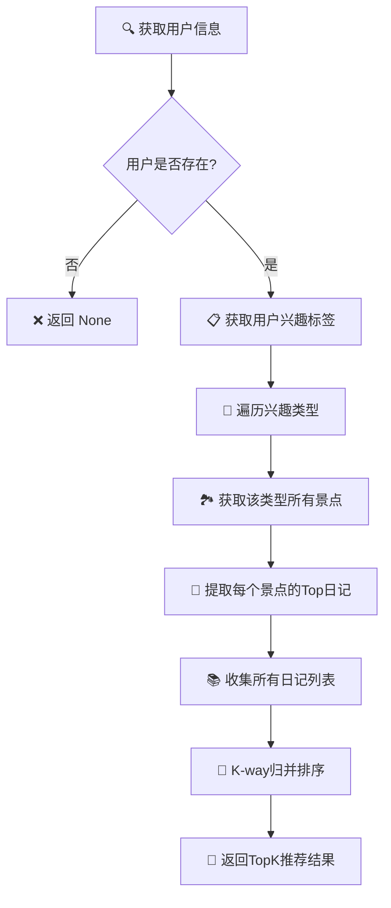

# 用户推荐日记功能分析报告

## 方法概述

**getRecommendDiariesTraditional** 是个性化旅游系统中的核心推荐算法，用于根据用户的兴趣偏好为其推荐相关的旅行日记。该方法采用传统的多路归并排序策略，通过分析用户喜好的景点类型，收集相关日记并按评分进行排序推荐。

### 核心性能指标
- **时间复杂度**: O(N log N) 
- **空间复杂度**: O(N)
- **归并策略**: K-way merge

## 算法流程图



## 数据结构分析

### 1. User对象
- **用途**: 存储用户基本信息和兴趣偏好
- **关键属性**: likes_type (兴趣标签列表)
- **时间复杂度**: O(1) 访问用户信息

### 2. SpotManager
- **用途**: 管理景点数据和分类索引
- **关键方法**: getTopKByType() 获取分类景点
- **时间复杂度**: O(k) 获取k个景点

### 3. TopKHeap数组
- **用途**: 为每个景点维护其日记的最大堆
- **关键操作**: getTopK() 获取前k个日记
- **时间复杂度**: O(k log n) 堆操作

### 4. K-way归并
- **用途**: 合并多个已排序的日记列表
- **数据结构**: MinHeap + 多路指针
- **时间复杂度**: O(N log k) 归并k个列表

### 5. Diary对象
- **用途**: 存储日记的详细信息
- **排序键**: score(评分), visited_time(访问量)
- **时间复杂度**: O(1) 属性访问

### 6. 推荐列表
- **用途**: 存储最终的推荐结果
- **结构**: List[Diary] 有序列表
- **时间复杂度**: O(k) 构建结果列表

## 算法步骤详解

### 步骤1: 用户验证与数据获取
通过 userId 获取用户对象，验证用户存在性，提取用户的兴趣标签列表 likes_type

```python
user = self.getUser(userId)
user_likes = user.likes_type
```

### 步骤2: 兴趣类型遍历
遍历用户的每个兴趣类型，为每种类型收集相关的景点和日记数据

```python
for spot_type in user_likes:
    spots_of_type = spotManager.getTopKByType(spot_type, k=-1)
```

### 步骤3: 景点日记提取
对于每个景点，从其专属的TopKHeap中提取前topK个高评分日记

```python
for spot in spots_of_type:
    spot_id = spot["id"]
    diarys = spotManager.spotDiaryHeapArray[spot_id-1].getTopK(topK)
```

### 步骤4: 日记列表收集
将所有获取到的日记列表添加到推荐列表集合中，形成多个已排序的子列表

```python
if diarys:
    recommended_diaries.append(diarys)
```

### 步骤5: K-way归并排序
使用k路归并算法将多个已排序的日记列表合并为一个全局有序的推荐列表

```python
recommended_diaries = kwaymerge.k_way_merge_descending(recommended_diaries)
```

### 步骤6: 结果构建与返回
从归并结果中选取前topK个日记ID，获取完整的日记对象并返回

```python
diarys = []
for i in range(topK):
    diarys.append(diaryManager.getDiary(recommended_diaries[i]["id"]))
```

## 时间复杂度分析

| 操作步骤 | 时间复杂度 | 说明 |
|---------|-----------|------|
| 用户验证 | O(1) | 哈希表查找用户信息 |
| 获取兴趣类型景点 | O(S) | S为该类型景点总数 |
| 景点日记提取 | O(k log n) | 从堆中获取前k个元素 |
| K-way归并排序 | O(N log L) | N为总日记数，L为列表数量 |
| 结果对象构建 | O(k) | 构建k个日记对象 |
| **总体复杂度** | **O(N log N)** | dominated by 归并排序 |

### 复杂度变量说明

| 变量 | 含义 | 典型范围 |
|-----|------|---------|
| N | 所有相关日记的总数量 | 100 ~ 10,000 |
| k | 用户请求的推荐日记数量(topK) | 5 ~ 50 |
| L | 需要归并的日记列表数量 | 10 ~ 100 |
| S | 单个兴趣类型的景点数量 | 20 ~ 200 |
| T | 用户兴趣类型的数量 | 1 ~ 10 |

## K-way归并算法细节

K-way归并排序是该推荐算法的核心组件，使用最小堆来高效合并多个已排序的日记列表。

### 算法原理

1. **初始化最小堆**: 创建MinHeap，将每个列表的第一个元素加入堆中，堆元素格式为：(-value1, -value2, list_index, item_index, item_dict)

2. **归并过程**: 重复执行：从堆顶弹出最大元素，加入结果列表，如果该元素所在列表还有下一个元素，则将下一个元素加入堆

3. **排序策略**: 使用负值技巧：-value1作为主排序键，-value2作为次排序键，实现降序排列

```python
def k_way_merge_descending(list_of_lists):
    min_heap = MinHeap()
    result = []
    
    # 初始化堆
    for i, sub_list in enumerate(list_of_lists):
        if sub_list:
            item = sub_list[0]
            heap_item = (-item['value1'], -item['value2'], i, 0, item)
            min_heap.push(heap_item)
    
    # 归并过程
    while not min_heap.is_empty():
        neg_v1, neg_v2, list_idx, item_idx, current_item = min_heap.pop()
        result.append(current_item)
        
        # 添加下一个元素
        next_item_idx = item_idx + 1
        if next_item_idx < len(list_of_lists[list_idx]):
            next_item = list_of_lists[list_idx][next_item_idx]
            new_heap_item = (-next_item['value1'], -next_item['value2'], 
                           list_idx, next_item_idx, next_item)
            min_heap.push(new_heap_item)
```

## 性能优化建议

### 1. 早期过滤优化
在景点级别就限制提取的日记数量，避免过多无效数据参与归并排序，减少整体计算量。

### 2. 分页推荐
实现分页推荐机制，不一次性加载所有推荐结果，提高响应速度和用户体验。

### 3. 缓存策略
对用户推荐结果进行缓存，设置合理的过期时间，减少重复计算开销。

### 4. 并行处理
对不同兴趣类型的数据收集过程进行并行化处理，充分利用多核CPU资源。

## 算法优缺点分析

### 优点
- ✅ 结果准确性高，充分考虑用户兴趣
- ✅ 排序稳定，保证推荐质量一致性
- ✅ 算法逻辑清晰，易于理解和维护
- ✅ 支持多维度排序（评分+访问量）

### 缺点
- ❌ 时间复杂度较高，大数据量时性能受限
- ❌ 内存占用较大，需存储所有候选日记
- ❌ 实时性不足，无法快速响应数据变化
- ❌ 缺乏个性化权重调整机制

## 总结

**getRecommendDiariesTraditional** 方法实现了一个基于用户兴趣的传统推荐算法，通过多路归并排序确保了推荐结果的准确性和有序性。该算法在中小规模数据集上表现良好，为用户提供了高质量的个性化推荐服务。

### 核心特点
- **稳定**的排序算法
- **多维**的排序标准  
- **个性化**的推荐策略

未来可以考虑引入机器学习算法、实时计算框架和分布式处理技术，进一步提升推荐系统的性能和用户体验。
